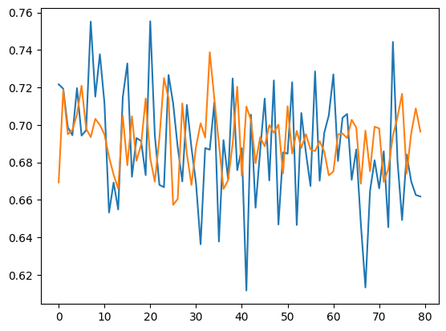
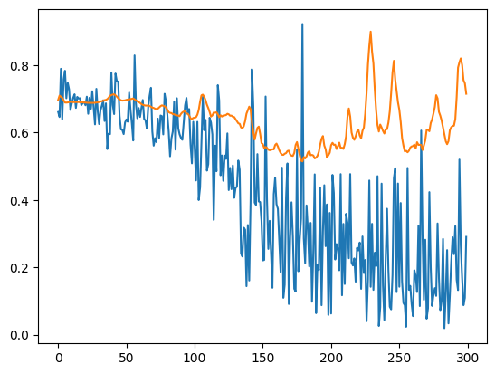
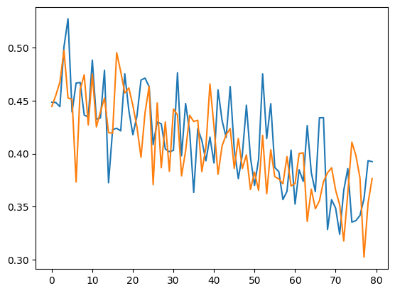
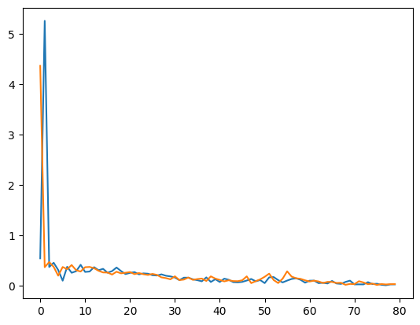

<h1> Грифики ошибок нейросети на тренировочной и валидационной выборки </h1>

- График с использованием функции потери CrossEntropyLoss и оптимизатором SGD\

* График с использованием функции потери CrossEntropyLoss и оптимизатором Adam\

- График с использованием MSELoss и функцией потери SGD\

* График с использованием MSELoss и функцией потери Adam\
