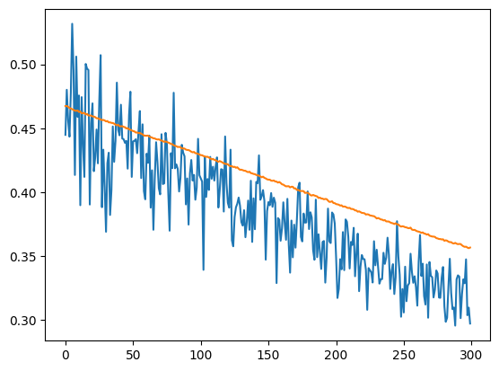

<h1> Ошибки нейросети на тренировочной и валидационной выборки </h1>

- <b>Использование функции потери CrossEntropyLoss и оптимизатором SGD</b>\
Ошибка на тестовой выборке 3/6 = 50%. Выдаёт всегда один ответ \

* <b>Использование функции потери CrossEntropyLoss и оптимизатором Adam</b>\
Ошибка на тестовой выборке 1/6 = 17%. Нестабильное обучение\

- <b>Использование функции потери MSELoss и оптимизатором SGD</b>\
Ошибка на тестовой выборке 3/6 = 50%. Выдаёт всегда один ответ \

* <b>Использование функции потери MSELoss и оптимизатором Adam</b>\
Ошибка на тестовой выборке 0/6 = 0%. Обучение нейросети в большенстве случаев одинаково. Ошибка по дельте - 28%\
